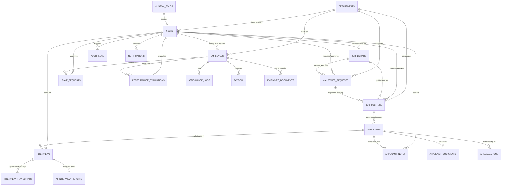

# ARTMS Database Schema Documentation

> **Last Updated:** 2026-08-06 13:07:22 (UTC+08:00)

This document provides a comprehensive specification of all database entities, tables, columns, constraints, and relationships for the **ARTMS (AI Recruitment & Management System)** backend codebase.

---

## 1. Entity-Relationship Diagram (ERD)

---

## 2. Table Definitions

### 2.1 `departments`
Stores organizational department units.

| Column Name | Data Type | Keys/Constraints | Description |
| :--- | :--- | :--- | :--- |
| `id` | `BIGINT` | `PK, AUTO_INCREMENT` | Primary key identifier |
| `department_name` | `VARCHAR(255)` | `NOT NULL` | Full name of department |
| `department_code` | `VARCHAR(50)` | `NULLABLE` | Short department code (e.g. IT, HR, FIN) |
| `description` | `TEXT` | `NULLABLE` | Description of department functions |
| `is_active` | `BOOLEAN` | `DEFAULT true` | Active operational status |
| `created_at` | `TIMESTAMP` | `NULLABLE` | Record creation timestamp |
| `updated_at` | `TIMESTAMP` | `NULLABLE` | Record last update timestamp |

---

### 2.2 `users`
System user accounts for authentication and role-based access control.

| Column Name | Data Type | Keys/Constraints | Description |
| :--- | :--- | :--- | :--- |
| `id` | `BIGINT` | `PK, AUTO_INCREMENT` | Primary key identifier |
| `name` | `VARCHAR(255)` | `NOT NULL` | User full name |
| `email` | `VARCHAR(255)` | `UNIQUE, NOT NULL` | Login email address |
| `email_verified_at` | `TIMESTAMP` | `NULLABLE` | Email verification timestamp |
| `password` | `VARCHAR(255)` | `NOT NULL` | Hashed password credential |
| `role` | `ENUM` | `NOT NULL` | `super_admin`, `hr_admin`, `coo`, `department_head`, `interviewer`, `employee` |
| `custom_role_id` | `BIGINT` | `FK -> custom_roles.id, NULLABLE` | Link to custom permission role |
| `department_id` | `BIGINT` | `FK -> departments.id, NULLABLE` | Associated department |
| `avatar` | `VARCHAR(255)` | `NULLABLE` | Profile picture image URL |
| `is_active` | `BOOLEAN` | `DEFAULT true` | Account active state |
| `remember_token` | `VARCHAR(100)` | `NULLABLE` | Authentication remember token |
| `created_at` | `TIMESTAMP` | `NULLABLE` | Record creation timestamp |
| `updated_at` | `TIMESTAMP` | `NULLABLE` | Record last update timestamp |

---

### 2.3 `employees`
Employee 201 records for workforce management.

| Column Name | Data Type | Keys/Constraints | Description |
| :--- | :--- | :--- | :--- |
| `id` | `BIGINT` | `PK, AUTO_INCREMENT` | Primary key identifier |
| `employee_id` | `VARCHAR(50)` | `UNIQUE, NOT NULL` | Formatted ID string (e.g., EMP-001) |
| `user_id` | `BIGINT` | `FK -> users.id, NULLABLE` | Linked system user account |
| `first_name` | `VARCHAR(255)` | `NOT NULL` | Employee first name |
| `middle_name` | `VARCHAR(255)` | `NULLABLE` | Employee middle name |
| `last_name` | `VARCHAR(255)` | `NOT NULL` | Employee last name |
| `email` | `VARCHAR(255)` | `UNIQUE, NOT NULL` | Work email address |
| `phone` | `VARCHAR(50)` | `NULLABLE` | Contact phone number |
| `department_id` | `BIGINT` | `FK -> departments.id, NOT NULL` | Assigned department |
| `job_title` | `VARCHAR(255)` | `NOT NULL` | Position title |
| `employment_status` | `ENUM` | `NOT NULL` | `regular`, `probationary`, `contractual`, `project_based`, `ojt`, `resigned`, `terminated` |
| `hire_date` | `DATE` | `NOT NULL` | Official date of employment |
| `birth_date` | `DATE` | `NULLABLE` | Date of birth |
| `gender` | `VARCHAR(50)` | `NULLABLE` | Gender identity |
| `address` | `TEXT` | `NULLABLE` | Home residential address |
| `emergency_contact_name` | `VARCHAR(255)` | `NULLABLE` | Emergency contact person |
| `emergency_contact_phone` | `VARCHAR(50)` | `NULLABLE` | Emergency contact phone number |
| `basic_salary` | `DECIMAL(10,2)` | `NULLABLE` | Base monthly salary compensation |
| `avatar` | `VARCHAR(255)` | `NULLABLE` | Profile avatar image path |
| `documents_status` | `ENUM` | `DEFAULT 'pending'` | 201 file completeness: `complete`, `incomplete`, `pending` |
| `created_at` | `TIMESTAMP` | `NULLABLE` | Record creation timestamp |
| `updated_at` | `TIMESTAMP` | `NULLABLE` | Record last update timestamp |

---

### 2.4 `job_library`
Centralized repository of approved job specification templates.

| Column Name | Data Type | Keys/Constraints | Description |
| :--- | :--- | :--- | :--- |
| `id` | `BIGINT` | `PK, AUTO_INCREMENT` | Primary key identifier |
| `job_title` | `VARCHAR(255)` | `NOT NULL` | Position title |
| `job_description` | `TEXT` | `NOT NULL` | Overview description |
| `qualifications` | `JSON` | `NOT NULL` | Qualification requirement blocks |
| `responsibilities` | `JSON` | `NOT NULL` | Key responsibility blocks |
| `job_category` | `VARCHAR(255)` | `NULLABLE` | Standard job classification |
| `employment_type` | `ENUM` | `DEFAULT 'full_time'` | `full_time`, `part_time`, `contractual`, `project_based`, `probationary`, `ojt` |
| `salary_type` | `ENUM` | `DEFAULT 'exact'` | `exact`, `range` |
| `salary_min` | `DECIMAL(10,2)` | `NULLABLE` | Minimum/exact monthly salary |
| `salary_max` | `DECIMAL(10,2)` | `NULLABLE` | Maximum salary for range |
| `approval_status` | `ENUM` | `DEFAULT 'pending'` | Executive approval status: `pending`, `approved`, `rejected`, `revised` |
| `approval_remarks` | `TEXT` | `NULLABLE` | COO executive feedback notes |
| `approved_by` | `BIGINT` | `FK -> users.id, NULLABLE` | Approving executive ID |
| `approved_at` | `TIMESTAMP` | `NULLABLE` | Executive approval timestamp |
| `created_by` | `BIGINT` | `FK -> users.id, NOT NULL` | Creator HR Admin user ID |
| `is_active` | `BOOLEAN` | `DEFAULT true` | Active template state |
| `created_at` | `TIMESTAMP` | `NULLABLE` | Record creation timestamp |
| `updated_at` | `TIMESTAMP` | `NULLABLE` | Record last update timestamp |

---

### 2.5 `job_categories`
Classification lookup table for job categories.

| Column Name | Data Type | Keys/Constraints | Description |
| :--- | :--- | :--- | :--- |
| `id` | `BIGINT` | `PK, AUTO_INCREMENT` | Primary key identifier |
| `name` | `VARCHAR(255)` | `UNIQUE, NOT NULL` | Category name |
| `description` | `TEXT` | `NULLABLE` | Optional description |
| `created_at` | `TIMESTAMP` | `NULLABLE` | Record creation timestamp |
| `updated_at` | `TIMESTAMP` | `NULLABLE` | Record last update timestamp |

---

### 2.6 `manpower_requests`
Position Requisition Forms (PRF) submitted for headcount additions.

| Column Name | Data Type | Keys/Constraints | Description |
| :--- | :--- | :--- | :--- |
| `id` | `BIGINT` | `PK, AUTO_INCREMENT` | Primary key identifier |
| `department_id` | `BIGINT` | `FK -> departments.id, NOT NULL` | Requesting department |
| `requested_by` | `BIGINT` | `FK -> users.id, NOT NULL` | Requesting user |
| `job_library_id` | `BIGINT` | `FK -> job_library.id, NULLABLE` | Linked job template |
| `position_needed` | `VARCHAR(255)` | `NOT NULL` | Position title required |
| `headcount` | `INT` | `NOT NULL` | Number of openings requested |
| `justification` | `TEXT` | `NOT NULL` | Business justification |
| `needed_by` | `DATE` | `NOT NULL` | Target fulfillment date |
| `urgency` | `ENUM` | `DEFAULT 'medium'` | Urgency level: `low`, `medium`, `high`, `critical` |
| `status` | `ENUM` | `DEFAULT 'pending'` | PRF status: `pending`, `approved`, `rejected`, `cancelled` |
| `approval_remarks` | `TEXT` | `NULLABLE` | COO evaluation remarks |
| `approved_by` | `BIGINT` | `FK -> users.id, NULLABLE` | Approving executive ID |
| `approved_at` | `TIMESTAMP` | `NULLABLE` | PRF approval timestamp |
| `minimum_fit_score` | `DECIMAL(5,2)` | `DEFAULT 70.00` | AI resume screening cutoff threshold % |
| `qualifications` | `JSON` | `NULLABLE` | Customized requirements for requisition |
| `responsibilities` | `JSON` | `NULLABLE` | Customized duties for requisition |
| `created_at` | `TIMESTAMP` | `NULLABLE` | Record creation timestamp |
| `updated_at` | `TIMESTAMP` | `NULLABLE` | Record last update timestamp |

---

### 2.7 `job_postings`
Published job advertisements open for applicant submissions.

| Column Name | Data Type | Keys/Constraints | Description |
| :--- | :--- | :--- | :--- |
| `id` | `BIGINT` | `PK, AUTO_INCREMENT` | Primary key identifier |
| `job_library_id` | `BIGINT` | `FK -> job_library.id, NOT NULL` | Associated job library template |
| `department_id` | `BIGINT` | `FK -> departments.id, NOT NULL` | Associated department |
| `manpower_request_id` | `BIGINT` | `FK -> manpower_requests.id, NULLABLE` | Originating approved PRF |
| `requested_by` | `BIGINT` | `FK -> users.id, NOT NULL` | Posting publisher ID |
| `vacancies_count` | `INT` | `DEFAULT 1` | Open headcount vacancies needed |
| `location` | `VARCHAR(255)` | `NULLABLE` | Work location/setup |
| `description` | `TEXT` | `NULLABLE` | Customized ad description |
| `posting_date` | `DATE` | `NULLABLE` | Publication start date |
| `closing_date` | `DATE` | `NULLABLE` | Application deadline date |
| `status` | `ENUM` | `DEFAULT 'published'` | Status: `published`, `draft`, `closed`, `cancelled`, `pending_approval` |
| `approval_status` | `ENUM` | `DEFAULT 'approved'` | COO approval status: `pending`, `approved`, `rejected`, `revised` |
| `approval_remarks` | `TEXT` | `NULLABLE` | Executive revision remarks |
| `approved_by` | `BIGINT` | `FK -> users.id, NULLABLE` | Approving executive |
| `approved_at` | `TIMESTAMP` | `NULLABLE` | Approval timestamp |
| `is_published` | `BOOLEAN` | `DEFAULT false` | Public visibility flag |
| `qualifications` | `JSON` | `NULLABLE` | Custom ad qualifications |
| `responsibilities` | `JSON` | `NULLABLE` | Custom ad responsibilities |
| `is_modified_from_prf` | `BOOLEAN` | `DEFAULT false` | Tracks modifications from PRF baseline |
| `created_at` | `TIMESTAMP` | `NULLABLE` | Record creation timestamp |
| `updated_at` | `TIMESTAMP` | `NULLABLE` | Record last update timestamp |

---

### 2.8 `applicants`
Candidates applying for open job positions.

| Column Name | Data Type | Keys/Constraints | Description |
| :--- | :--- | :--- | :--- |
| `id` | `BIGINT` | `PK, AUTO_INCREMENT` | Primary key identifier |
| `applicant_code` | `VARCHAR(50)` | `UNIQUE, NOT NULL` | Formatted code (e.g. APP-0001) |
| `job_posting_id` | `BIGINT` | `FK -> job_postings.id, NOT NULL` | Target job posting |
| `first_name` | `VARCHAR(255)` | `NOT NULL` | First name |
| `middle_name` | `VARCHAR(255)` | `NULLABLE` | Middle name |
| `last_name` | `VARCHAR(255)` | `NOT NULL` | Last name |
| `email` | `VARCHAR(255)` | `NOT NULL` | Applicant email |
| `phone` | `VARCHAR(50)` | `NOT NULL` | Applicant phone |
| `resume_path` | `VARCHAR(255)` | `NULLABLE` | Uploaded resume file path |
| `status` | `ENUM` | `DEFAULT 'new'` | Pipeline status: `new`, `screening`, `interview_scheduled`, `interview_completed`, `offered`, `hired`, `rejected`, `withdrawn` |
| `current_stage` | `VARCHAR(100)` | `DEFAULT 'Applied'` | Current recruitment stage label |
| `source` | `VARCHAR(100)` | `DEFAULT 'Career Portal'` | Application sourcing channel |
| `created_at` | `TIMESTAMP` | `NULLABLE` | Record creation timestamp |
| `updated_at` | `TIMESTAMP` | `NULLABLE` | Record last update timestamp |

---

### 2.9 `applicant_documents`
Supplementary attachments uploaded by applicants.

| Column Name | Data Type | Keys/Constraints | Description |
| :--- | :--- | :--- | :--- |
| `id` | `BIGINT` | `PK, AUTO_INCREMENT` | Primary key identifier |
| `applicant_id` | `BIGINT` | `FK -> applicants.id, NOT NULL` | Owning applicant |
| `document_type` | `VARCHAR(100)` | `NOT NULL` | File type (e.g. resume, portfolio) |
| `file_path` | `VARCHAR(255)` | `NOT NULL` | File storage path |
| `file_name` | `VARCHAR(255)` | `NOT NULL` | Original filename |
| `file_size` | `INT` | `NULLABLE` | File size in bytes |
| `mime_type` | `VARCHAR(100)` | `NULLABLE` | MIME format |
| `created_at` | `TIMESTAMP` | `NULLABLE` | Record creation timestamp |
| `updated_at` | `TIMESTAMP` | `NULLABLE` | Record last update timestamp |

---

### 2.10 `ai_evaluations`
AI automated resume parsing and fit score evaluations.

| Column Name | Data Type | Keys/Constraints | Description |
| :--- | :--- | :--- | :--- |
| `id` | `BIGINT` | `PK, AUTO_INCREMENT` | Primary key identifier |
| `applicant_id` | `BIGINT` | `FK -> applicants.id, NOT NULL` | Evaluated applicant |
| `overall_score` | `DECIMAL(5,2)` | `NOT NULL` | Overall AI score percentage |
| `skills_score` | `DECIMAL(5,2)` | `NULLABLE` | Skills match score |
| `experience_score` | `DECIMAL(5,2)` | `NULLABLE` | Experience match score |
| `education_score` | `DECIMAL(5,2)` | `NULLABLE` | Education match score |
| `fit_score` | `DECIMAL(5,2)` | `NULLABLE` | Role fit score |
| `recommendation` | `VARCHAR(100)` | `NULLABLE` | AI recommendation (e.g. Highly Recommended) |
| `summary` | `TEXT` | `NULLABLE` | AI evaluation summary |
| `strengths` | `JSON` | `NULLABLE` | Identified strengths list |
| `concerns` | `JSON` | `NULLABLE` | Identified concerns list |
| `skills_extracted` | `JSON` | `NULLABLE` | Extracted candidate skills |
| `raw_analysis` | `JSON` | `NULLABLE` | Raw LLM output payload |
| `evaluated_at` | `TIMESTAMP` | `NOT NULL` | Evaluation completion time |
| `created_at` | `TIMESTAMP` | `NULLABLE` | Record creation timestamp |
| `updated_at` | `TIMESTAMP` | `NULLABLE` | Record last update timestamp |

---

### 2.11 `interviews`
Scheduled interviews (human and AI voice screening).

| Column Name | Data Type | Keys/Constraints | Description |
| :--- | :--- | :--- | :--- |
| `id` | `BIGINT` | `PK, AUTO_INCREMENT` | Primary key identifier |
| `applicant_id` | `BIGINT` | `FK -> applicants.id, NOT NULL` | Candidate |
| `interviewer_id` | `BIGINT` | `FK -> users.id, NULLABLE` | Assigned interviewer user |
| `interview_type` | `ENUM` | `NOT NULL` | `initial`, `technical`, `hr`, `final`, `ai_screening` |
| `interview_stage` | `ENUM` | `DEFAULT 'initial_screening'` | `initial_screening`, `technical_interview`, `hr_interview`, `final_interview` |
| `scheduled_at` | `DATETIME` | `NOT NULL` | Scheduled date and time |
| `duration_minutes` | `INT` | `DEFAULT 30` | Expected duration in minutes |
| `status` | `ENUM` | `DEFAULT 'scheduled'` | `scheduled`, `in_progress`, `completed`, `cancelled`, `rescheduled` |
| `location_or_link` | `VARCHAR(255)` | `NULLABLE` | Meeting room link / address |
| `notes` | `TEXT` | `NULLABLE` | General interview notes |
| `interviewer_notes` | `TEXT` | `NULLABLE` | Private interviewer notes |
| `feedback` | `TEXT` | `NULLABLE` | Post-interview feedback |
| `rating` | `INT` | `NULLABLE` | Rating score (1-5) |
| `livekit_room_name` | `VARCHAR(255)` | `NULLABLE` | LiveKit WebRTC room name |
| `livekit_room_sid` | `VARCHAR(255)` | `NULLABLE` | LiveKit session SID |
| `recording_url` | `VARCHAR(255)` | `NULLABLE` | Video/Audio recording URL |
| `audio_url` | `VARCHAR(255)` | `NULLABLE` | Audio track file URL |
| `applicant_name` | `VARCHAR(255)` | `NULLABLE` | Cached applicant name |
| `applicant_email` | `VARCHAR(255)` | `NULLABLE` | Cached applicant email |
| `created_at` | `TIMESTAMP` | `NULLABLE` | Record creation timestamp |
| `updated_at` | `TIMESTAMP` | `NULLABLE` | Record last update timestamp |

---

### 2.12 `interview_transcripts`
Real-time transcript logs for LiveKit AI voice interviews.

| Column Name | Data Type | Keys/Constraints | Description |
| :--- | :--- | :--- | :--- |
| `id` | `BIGINT` | `PK, AUTO_INCREMENT` | Primary key identifier |
| `interview_id` | `BIGINT` | `FK -> interviews.id, NOT NULL` | Parent interview session |
| `speaker` | `ENUM` | `NOT NULL` | `interviewer`, `candidate`, `ai_agent` |
| `message` | `TEXT` | `NOT NULL` | Transcribed dialogue text |
| `timestamp_seconds` | `DECIMAL(8,2)` | `NULLABLE` | Audio timeline offset in seconds |
| `created_at` | `TIMESTAMP` | `NULLABLE` | Record creation timestamp |
| `updated_at` | `TIMESTAMP` | `NULLABLE` | Record last update timestamp |

---

### 2.13 `ai_interview_reports`
AI-generated analysis reports from completed voice interviews.

| Column Name | Data Type | Keys/Constraints | Description |
| :--- | :--- | :--- | :--- |
| `id` | `BIGINT` | `PK, AUTO_INCREMENT` | Primary key identifier |
| `interview_id` | `BIGINT` | `FK -> interviews.id, NOT NULL` | Evaluated interview |
| `overall_score` | `DECIMAL(5,2)` | `NOT NULL` | Overall interview score % |
| `technical_score` | `DECIMAL(5,2)` | `NULLABLE` | Technical competence score |
| `communication_score` | `DECIMAL(5,2)` | `NULLABLE` | Communication skills score |
| `problem_solving_score` | `DECIMAL(5,2)` | `NULLABLE` | Problem solving rating |
| `culture_fit_score` | `DECIMAL(5,2)` | `NULLABLE` | Organizational culture fit rating |
| `summary` | `TEXT` | `NULLABLE` | Qualitative summary report |
| `key_strengths` | `JSON` | `NULLABLE` | Key strengths list |
| `areas_for_improvement` | `JSON` | `NULLABLE` | Improvement points |
| `question_analysis` | `JSON` | `NULLABLE` | Question-by-question breakdown |
| `created_at` | `TIMESTAMP` | `NULLABLE` | Record creation timestamp |
| `updated_at` | `TIMESTAMP` | `NULLABLE` | Record last update timestamp |

---

### 2.14 `applicant_notes`
Comments and team collaboration notes attached to applicants.

| Column Name | Data Type | Keys/Constraints | Description |
| :--- | :--- | :--- | :--- |
| `id` | `BIGINT` | `PK, AUTO_INCREMENT` | Primary key identifier |
| `applicant_id` | `BIGINT` | `FK -> applicants.id, NOT NULL` | Target applicant |
| `user_id` | `BIGINT` | `FK -> users.id, NOT NULL` | Note author user ID |
| `note` | `TEXT` | `NOT NULL` | Note text content |
| `created_at` | `TIMESTAMP` | `NULLABLE` | Record creation timestamp |
| `updated_at` | `TIMESTAMP` | `NULLABLE` | Record last update timestamp |

---

### 2.15 `attendance_logs`
Daily time-in and time-out attendance tracking.

| Column Name | Data Type | Keys/Constraints | Description |
| :--- | :--- | :--- | :--- |
| `id` | `BIGINT` | `PK, AUTO_INCREMENT` | Primary key identifier |
| `employee_id` | `BIGINT` | `FK -> employees.id, NOT NULL` | Linked employee |
| `date` | `DATE` | `NOT NULL` | Log date |
| `time_in` | `TIME` | `NULLABLE` | Clock-in time |
| `time_out` | `TIME` | `NULLABLE` | Clock-out time |
| `status` | `ENUM` | `NOT NULL` | Attendance state: `present`, `absent`, `late`, `half_day`, `on_leave` |
| `hours_worked` | `DECIMAL(5,2)` | `DEFAULT 0.00` | Net regular hours worked |
| `overtime_hours` | `DECIMAL(5,2)` | `DEFAULT 0.00` | Overtime hours recorded |
| `remarks` | `TEXT` | `NULLABLE` | Exception remarks |
| `created_at` | `TIMESTAMP` | `NULLABLE` | Record creation timestamp |
| `updated_at` | `TIMESTAMP` | `NULLABLE` | Record last update timestamp |

---

### 2.16 `leave_requests`
Employee leave applications and approval workflows.

| Column Name | Data Type | Keys/Constraints | Description |
| :--- | :--- | :--- | :--- |
| `id` | `BIGINT` | `PK, AUTO_INCREMENT` | Primary key identifier |
| `employee_id` | `BIGINT` | `FK -> employees.id, NOT NULL` | Applying employee |
| `leave_type` | `ENUM` | `NOT NULL` | `vacation`, `sick`, `emergency`, `maternity`, `paternity`, `bereavement`, `unpaid` |
| `start_date` | `DATE` | `NOT NULL` | Leave start date |
| `end_date` | `DATE` | `NOT NULL` | Leave end date |
| `days_count` | `DECIMAL(4,1)` | `NOT NULL` | Total leave days |
| `reason` | `TEXT` | `NOT NULL` | Employee reason |
| `status` | `ENUM` | `DEFAULT 'pending'` | Status: `pending`, `approved`, `rejected` |
| `approved_by` | `BIGINT` | `FK -> users.id, NULLABLE` | Approver user ID |
| `rejection_reason` | `TEXT` | `NULLABLE` | Rejection explanation |
| `created_at` | `TIMESTAMP` | `NULLABLE` | Record creation timestamp |
| `updated_at` | `TIMESTAMP` | `NULLABLE` | Record last update timestamp |

---

### 2.17 `payroll`
Monthly payroll calculations and disbursement records.

| Column Name | Data Type | Keys/Constraints | Description |
| :--- | :--- | :--- | :--- |
| `id` | `BIGINT` | `PK, AUTO_INCREMENT` | Primary key identifier |
| `employee_id` | `BIGINT` | `FK -> employees.id, NOT NULL` | Paid employee |
| `pay_period_start` | `DATE` | `NOT NULL` | Payroll cycle start date |
| `pay_period_end` | `DATE` | `NOT NULL` | Payroll cycle end date |
| `basic_salary` | `DECIMAL(10,2)` | `NOT NULL` | Base monthly salary |
| `overtime_pay` | `DECIMAL(10,2)` | `DEFAULT 0.00` | Overtime compensation |
| `allowances` | `DECIMAL(10,2)` | `DEFAULT 0.00` | Total allowances |
| `deductions` | `DECIMAL(10,2)` | `DEFAULT 0.00` | Deductions (tax, SSS, PhilHealth, PagIBIG) |
| `net_pay` | `DECIMAL(10,2)` | `NOT NULL` | Final net pay amount |
| `status` | `ENUM` | `DEFAULT 'draft'` | Payroll status: `draft`, `processed`, `paid` |
| `payment_date` | `DATE` | `NULLABLE` | Disbursement date |
| `created_at` | `TIMESTAMP` | `NULLABLE` | Record creation timestamp |
| `updated_at` | `TIMESTAMP` | `NULLABLE` | Record last update timestamp |

---

### 2.18 `employee_documents`
201 file attachments stored for employees.

| Column Name | Data Type | Keys/Constraints | Description |
| :--- | :--- | :--- | :--- |
| `id` | `BIGINT` | `PK, AUTO_INCREMENT` | Primary key identifier |
| `employee_id` | `BIGINT` | `FK -> employees.id, NOT NULL` | Employee |
| `document_type` | `VARCHAR(100)` | `NOT NULL` | Document category (e.g. SSS, TIN, NBI) |
| `file_name` | `VARCHAR(255)` | `NOT NULL` | Original filename |
| `file_path` | `VARCHAR(255)` | `NOT NULL` | File storage path |
| `file_size` | `INT` | `NULLABLE` | File size in bytes |
| `mime_type` | `VARCHAR(100)` | `NULLABLE` | MIME format |
| `created_at` | `TIMESTAMP` | `NULLABLE` | Record creation timestamp |
| `updated_at` | `TIMESTAMP` | `NULLABLE` | Record last update timestamp |

---

### 2.19 `performance_evaluations`
Periodic employee appraisal and competency ratings.

| Column Name | Data Type | Keys/Constraints | Description |
| :--- | :--- | :--- | :--- |
| `id` | `BIGINT` | `PK, AUTO_INCREMENT` | Primary key identifier |
| `employee_id` | `BIGINT` | `FK -> employees.id, NOT NULL` | Appraised employee |
| `evaluator_id` | `BIGINT` | `FK -> users.id, NOT NULL` | Evaluator user ID |
| `evaluation_period` | `VARCHAR(100)` | `NOT NULL` | Period string (e.g. Q1 2026, Annual) |
| `overall_rating` | `DECIMAL(3,2)` | `NOT NULL` | Overall score (1.00 - 5.00) |
| `goals_achievement_rating` | `DECIMAL(3,2)` | `NULLABLE` | Goals achievement score |
| `competencies_rating` | `DECIMAL(3,2)` | `NULLABLE` | Core competencies score |
| `feedback` | `TEXT` | `NULLABLE` | Detailed narrative feedback |
| `goals` | `TEXT` | `NULLABLE` | Next cycle goals |
| `status` | `ENUM` | `DEFAULT 'draft'` | Status: `draft`, `submitted`, `completed` |
| `created_at` | `TIMESTAMP` | `NULLABLE` | Record creation timestamp |
| `updated_at` | `TIMESTAMP` | `NULLABLE` | Record last update timestamp |

---

### 2.20 `audit_logs`
Security and administrative activity trail.

| Column Name | Data Type | Keys/Constraints | Description |
| :--- | :--- | :--- | :--- |
| `id` | `BIGINT` | `PK, AUTO_INCREMENT` | Primary key identifier |
| `user_id` | `BIGINT` | `FK -> users.id, NULLABLE` | User who performed action |
| `action` | `VARCHAR(100)` | `NOT NULL` | Event action (e.g. `create`, `update`, `login`) |
| `module` | `VARCHAR(100)` | `NOT NULL` | Module impacted (e.g. `job_posting`, `employees`) |
| `description` | `TEXT` | `NOT NULL` | Descriptive log message |
| `ip_address` | `VARCHAR(45)` | `NULLABLE` | Client IP address |
| `user_agent` | `TEXT` | `NULLABLE` | User agent browser string |
| `created_at` | `TIMESTAMP` | `NULLABLE` | Record creation timestamp |
| `updated_at` | `TIMESTAMP` | `NULLABLE` | Record last update timestamp |

---

### 2.21 `notifications`
In-app user notifications.

| Column Name | Data Type | Keys/Constraints | Description |
| :--- | :--- | :--- | :--- |
| `id` | `BIGINT` | `PK, AUTO_INCREMENT` | Primary key identifier |
| `user_id` | `BIGINT` | `FK -> users.id, NOT NULL` | Target recipient user ID |
| `title` | `VARCHAR(255)` | `NOT NULL` | Notification title |
| `message` | `TEXT` | `NOT NULL` | Message body |
| `type` | `VARCHAR(50)` | `DEFAULT 'info'` | Alert tone (`info`, `warning`, `request`, `success`) |
| `link` | `VARCHAR(255)` | `NULLABLE` | Navigation link URI |
| `read_at` | `TIMESTAMP` | `NULLABLE` | Read timestamp |
| `created_at` | `TIMESTAMP` | `NULLABLE` | Record creation timestamp |
| `updated_at` | `TIMESTAMP` | `NULLABLE` | Record last update timestamp |

---

### 2.22 `custom_roles`
Custom user roles created dynamically.

| Column Name | Data Type | Keys/Constraints | Description |
| :--- | :--- | :--- | :--- |
| `id` | `BIGINT` | `PK, AUTO_INCREMENT` | Primary key identifier |
| `role_name` | `VARCHAR(255)` | `UNIQUE, NOT NULL` | Role identifier string |
| `description` | `TEXT` | `NULLABLE` | Role description |
| `created_at` | `TIMESTAMP` | `NULLABLE` | Record creation timestamp |
| `updated_at` | `TIMESTAMP` | `NULLABLE` | Record last update timestamp |

---

### 2.23 `permissions`
Module-level CRUD permission matrix per role.

| Column Name | Data Type | Keys/Constraints | Description |
| :--- | :--- | :--- | :--- |
| `id` | `BIGINT` | `PK, AUTO_INCREMENT` | Primary key identifier |
| `role` | `VARCHAR(100)` | `NOT NULL` | Target role identifier |
| `module` | `VARCHAR(100)` | `NOT NULL` | Target system module |
| `can_view` | `BOOLEAN` | `DEFAULT false` | View permission |
| `can_create` | `BOOLEAN` | `DEFAULT false` | Create permission |
| `can_edit` | `BOOLEAN` | `DEFAULT false` | Edit permission |
| `can_delete` | `BOOLEAN` | `DEFAULT false` | Delete permission |
| `created_at` | `TIMESTAMP` | `NULLABLE` | Record creation timestamp |
| `updated_at` | `TIMESTAMP` | `NULLABLE` | Record last update timestamp |

---

### 2.24 `personal_access_tokens`
Laravel Sanctum API tokens for REST authentication.

| Column Name | Data Type | Keys/Constraints | Description |
| :--- | :--- | :--- | :--- |
| `id` | `BIGINT` | `PK, AUTO_INCREMENT` | Primary key identifier |
| `tokenable_type` | `VARCHAR(255)` | `NOT NULL` | Polymorphic model class |
| `tokenable_id` | `BIGINT` | `NOT NULL` | Polymorphic model ID |
| `name` | `VARCHAR(255)` | `NOT NULL` | Token identifier name |
| `token` | `VARCHAR(64)` | `UNIQUE, NOT NULL` | Hashed token string |
| `abilities` | `TEXT` | `NULLABLE` | Token capabilities list |
| `last_used_at` | `TIMESTAMP` | `NULLABLE` | Last API request timestamp |
| `expires_at` | `TIMESTAMP` | `NULLABLE` | Expiration timestamp |
| `created_at` | `TIMESTAMP` | `NULLABLE` | Record creation timestamp |
| `updated_at` | `TIMESTAMP` | `NULLABLE` | Record last update timestamp |
