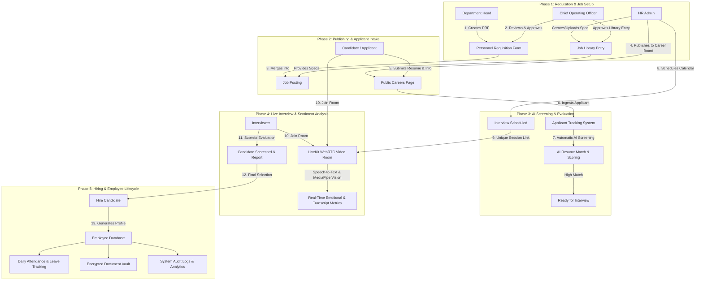

# ARTMS — Automated Recruitment & Talent Management System
## End-to-End System Flow, Features, & Technical Architecture Guide

---

## 1. Executive Summary

**ARTMS (Automated Recruitment & Talent Management System)** is an enterprise-grade, full-stack human resource management platform designed to automate and streamline the entire talent acquisition and employee management lifecycle. 

From initial **manpower requisition** and **AI-assisted job specification modeling**, to **public applicant intake**, **AI resume parsing**, **live video interviewing with real-time multi-modal sentiment tracking**, through to **hiring**, **employee record management**, **attendance**, and **role-tailored executive dashboards**.

---

## 2. Dual-Lens Perspective: How to Explain ARTMS

| Dimension | 👔 Non-Technical Explanation (For Executives, HR, & Clients) | 💻 Technical Explanation (For Engineers, Architects, & Tech Leads) |
| :--- | :--- | :--- |
| **What is it?** | A centralized, smart HR platform that replaces spreadsheets, manual emails, and fragmented hiring tools with an automated, AI-powered system. | A distributed React + Laravel Sanctum monolithic/API architecture with multi-tier caching, role-based authorization, and real-time WebRTC media channels. |
| **How does hiring work?** | Department heads request staff with one click, HR publishes the opening, applicants apply online, AI automatically ranks the best candidates, and interviewers evaluate applicants live with real-time AI assistance. | Structured workflow engine enforcing state transitions: `Draft -> Submitted -> Approved PRF -> Published Job Ad -> Ingested Resume -> AI Screening -> LiveKit WebRTC Session -> Sanctum Hired Transition`. |
| **Why is it secure?** | Every sensitive action requires 2-factor email OTP codes, actions are logged in an immutable audit ledger, and each user only sees what their role permits. | Custom middleware authentication (`Sanctum` Bearer tokens + 6-digit OTP verification tables with 60s cooldowns), strict RBAC authorization, and encrypted document storage. |
| **What makes it intelligent?** | It reads resumes in seconds, highlights top skills, and analyzes candidate confidence and speech during live video interviews. | OpenAI / LLM-based structured document parsing, TF-IDF / semantic vector keyword extraction, and client-side Google MediaPipe Vision face landmarking for emotional expression scoring. |

---

## 3. End-to-End System Flow Diagram



---

## 4. Comprehensive Feature Breakdown

### 4.1. Authentication, Access Control & Security
- **Multi-Role RBAC (Role-Based Access Control)**:
  - **Super Admin**: Complete administrative governance, role/permission matrix customization, system audit inspection, user archiving/restoration.
  - **HR Admin**: Recruitment pipeline management, Job Library authoring, applicant screening, interview scheduling, employee records.
  - **COO (Chief Operating Officer)**: Executive approvals (Job Library, PRF manpower requests), executive business analytics.
  - **Department Head**: Manpower requisition submission (PRF), department interview feedback, department roster monitoring.
  - **Interviewer**: Dedicated interview dashboard, calendar schedule, live interview room access, rubric scoring.
  - **Employee**: Self-service profile, attendance tracking, leave requests.
- **Two-Factor OTP Security**:
  - Automatically sends time-limited 6-digit verification codes to the user’s registered email on login.
  - Rate-limited with cooldown timers (60s) to prevent spam and brute-force attacks.
  - Granular bypass configuration for automated test environments and seed accounts.
- **Immutable Audit Logging**:
  - Every create, update, delete, approve, and bulk-action event is recorded with timestamps, user IDs, IP hints, and detailed payload metadata.

---

### 4.2. Job Library & AI Document Parser
- **Standardized Job Specifications**: Centralized repository of company positions, employment types (Full-time, Part-time, Contract, Remote), salary benchmarks (exact vs range), and categorized qualifications/responsibilities.
- **AI Document Parsing Engine**:
  - Upload PDF or DOCX job descriptions.
  - The AI parses unstructured resumes/job descriptions into structured categories (Education, Technical Skills, Core Responsibilities) with automatic form filling.
- **Executive Approval Workflow**: Positions drafted by HR require COO sign-off before being approved for organizational hiring.

---

### 4.3. Personnel Requisition Forms (PRF / Manpower Requests)
- **Department Hiring Requisitions**:
  - Department heads submit requests with required headcount, justification, urgency rating (`low`, `medium`, `high`, `critical`), and required timeline.
- **Intelligent Job Library Linking**: PRFs tie directly into pre-approved Job Library entries to maintain organizational consistency.
- **Multi-Level Revision & Approval**:
  - COO can approve, reject, or request revisions with specific review remarks.
  - Requester receives real-time in-app notifications on status changes.

---

### 4.4. Job Postings & Public Careers Board
- **PRF-to-Posting Synthesis**:
  - Convert approved PRFs into published job postings with a single click.
  - Automatic vacancy aggregation: If a PRF matches an active job listing, vacancies are merged dynamically without creating duplicate public ads.
- **Public Career Portal**:
  - Responsive, fast, search-optimized public portal for job seekers.
  - Search by keyword, department, and employment type.
- **Seamless Application Portal**:
  - Candidates apply with contact details, cover notes, and PDF resume upload.
  - Validates file format and file size with anti-tamper protections.

---

### 4.5. AI Resume Screening & Applicant Ranking
- **Automated AI Resume Ingestion**:
  - Extracts text from uploaded PDF/Word resumes.
  - Matches candidate qualifications against job requirements.
- **Match Scoring & Competency Breakdown**:
  - Produces a percentage match score (0-100%).
  - Generates key strengths, missing requirements, and potential red flags.
- **Fast-Track Filtering**: Enables HR to filter hundreds of applicants instantly to identify top-tier candidates for interview scheduling.

---

### 4.6. Visual Applicant Tracking System (ATS) Pipeline
- **Kanban Board & Stage Progression**:
  - Stages: `Applied` ➔ `Screened` ➔ `Ready for Interview` ➔ `Scheduled` ➔ `Interviewed` ➔ `Offered / Hired` ➔ `Rejected`.
- **Bulk Action Capabilities**: Bulk delete, bulk stage transitions, and batch notification triggers.
- **Comprehensive Candidate Profile Drawer**:
  - Embedded PDF resume viewer.
  - AI scorecards, notes from recruiters, past interview logs, and communication history.

---

### 4.7. Live Video Interview Room with AI Multi-Modal Telemetry
- **LiveKit WebRTC HD Video & Audio**:
  - Dedicated virtual interview rooms with low-latency media streams.
  - No external software required — runs directly in modern web browsers.
- **Real-Time Speech-to-Text & Transcripts**:
  - Automatic live transcription of candidate and interviewer responses.
- **MediaPipe Facial & Sentiment Tracking**:
  - Runs client-side computer vision models via Google MediaPipe.
  - Tracks candidate attentiveness, confidence levels, and sentiment markers throughout the interview.
- **Interactive Scoring Scorecard**:
  - Standardized rubrics for technical competency, communication, cultural fit, and problem-solving.
  - Instant generation of formatted PDF/printable interview reports.

---

### 4.8. Employee Onboarding & Record Management
- **One-Click Candidate-to-Employee Conversion**:
  - Automatically transfers applicant contact information, resume, and credentials into an official employee profile upon hire.
- **Employee 360° Management**:
  - Department assignments, job title, employment status, compensation details, and manager reporting lines.
- **Encrypted Document Vault**:
  - Store contracts, IDs, government documents, and certifications.
  - Granular access controls ensuring confidentiality.
- **Lifecycle Actions**: Clearance tracking, role promotions, and termination workflows.

---

### 4.9. Attendance & Leave Management
- **Daily Attendance Logging**: Track clock-ins, clock-outs, breaks, and calculate total rendered hours.
- **Leave Requisition & Balance Tracking**:
  - Vacation leave, sick leave, and emergency leave balances.
  - Department head and HR approval workflows.

---

### 4.10. Targeted Real-Time Notification Center
- **Precise Event Routing**:
  - When a PRF is submitted: Notifies COO and Super Admin only.
  - When a PRF is approved: Notifies the specific Department Head requester and HR.
  - Unrelated users do not receive noise notifications.
- **Visual Notification Drawer**: Unread badge counters, instant mark-as-read, and deep links directly to relevant records.

---

### 4.11. Executive Analytics & Dashboards
- **Role-Tailored Dashboards**:
  - **COO**: High-level headcount growth, department expense trajectory, open manpower requisitions.
  - **HR Admin**: Time-to-hire metrics, applicant pipeline health, interview completion rates.
  - **Department Head**: Team headcount, pending requisitions, candidate evaluation status.
- **Interactive Data Visualizations**: Recharts-powered graphs, vacancy distribution charts, and recruitment funnel analytics.

---

## 5. Role-by-Role Journey & User Guide

```
+------------------+-----------------------------------------------------------------------------------+
| Role             | Typical Daily Workflow                                                            |
+------------------+-----------------------------------------------------------------------------------+
| Department Head  | 1. Identifies team vacancy needs.                                                 |
|                  | 2. Submits PRF referencing pre-approved Job Library specifications.               |
|                  | 3. Receives notification when COO approves requisition.                           |
|                  | 4. Participates in live candidate interviews and submits scores.                 |
+------------------+-----------------------------------------------------------------------------------+
| HR Administrator | 1. Manages Job Library definitions & parses new job documents.                    |
|                  | 2. Publishes approved PRFs to the public Career Portal.                           |
|                  | 3. Reviews AI screening scores for incoming resumes.                              |
|                  | 4. Schedules candidate interviews and assigns interviewers.                       |
|                  | 5. Converts selected candidates into official employee records.                   |
+------------------+-----------------------------------------------------------------------------------+
| COO              | 1. Accesses executive dashboard to review company-wide workforce metrics.        |
|                  | 2. Reviews pending Job Library entries and approves/requests revisions.          |
|                  | 3. Evaluates PRF requisitions against company budget and headcount plans.         |
+------------------+-----------------------------------------------------------------------------------+
| Interviewer      | 1. Checks assigned interview schedule on the calendar.                           |
|                  | 2. Joins the LiveKit virtual room with candidate.                                 |
|                  | 3. Follows live transcript, notes key points, and submits structured evaluation.  |
+------------------+-----------------------------------------------------------------------------------+
| Super Admin      | 1. Configures roles, permissions, and security parameters.                        |
|                  | 2. Audits system activity logs for compliance and accountability.                |
|                  | 3. Manages user provisioning and system maintenance.                              |
+------------------+-----------------------------------------------------------------------------------+
```

---

## 6. Technical Architecture & Implementation Stack

```
[ Frontend: React 18 + Vite ]
   ├── Tailwind CSS + Vanilla CSS Custom Tokens
   ├── Radix UI Primitives + Lucide Icons
   ├── Recharts Data Visualization Engine
   ├── LiveKit WebRTC Client SDK
   ├── Google MediaPipe Vision Client Models
   └── Axios Client (Multi-Tier Memory & SessionStorage Cache)
             │
             ▼ (JSON REST APIs + Bearer Sanctum Authentication)
[ Backend: Laravel 11 ]
   ├── Routing & Controllers (RESTful Resource Design)
   ├── Role & Permission RBAC Middleware
   ├── Authentication & 2FA OTP Engine
   ├── Targeted Notification Resolver Service
   ├── Boot Cache & In-Memory Application State
   └── Audit Logging Event Subscribers
             │
             ▼
[ Database & Storage: MySQL + Secure Filesystem ]
   ├── Normalized Relational Schema
   ├── Soft Deletes & Foreign Key Cascade Constraints
   └── Secure Document & Resume Storage
```

---

## 7. Presentation & Pitch Script (Cheat-Sheet)

### 30-Second Elevator Pitch
> *"ARTMS is an all-in-one AI recruitment and talent management platform that cuts hiring time in half. It automates everything from department job requests and AI resume filtering to live video interviews with AI sentiment tracking and automated onboarding — giving executives complete visibility and HR teams an effortless workflow."*

### 2-Minute Feature Demonstration Walkthrough
1. **The Need (Requisition)**: *"A Department Head needs a new engineer. In seconds, they submit a Personnel Requisition Form tied to pre-approved job criteria."*
2. **The Executive Sign-off**: *"The COO gets an instant alert on their dashboard, checks company headcount, and approves the request."*
3. **Automated Publishing**: *"HR publishes the role to the live Careers board with a single click. Applicants apply online with their resumes."*
4. **AI Intelligence**: *"ARTMS’s AI parses incoming resumes, scores candidates on competency match, and ranks top applicants instantly."*
5. **Smart Interviewing**: *"Interviewer and candidate join a secure, browser-based video room. The AI tracks real-time transcription and sentiment, letting the interviewer focus on the conversation while generating a scorecard."*
6. **Hiring & Lifecycle**: *"With one click, the hired candidate becomes an active employee in the database, complete with document vault, attendance tracking, and full audit compliance."*

---
*Document generated for ARTMS Project Documentation.*
