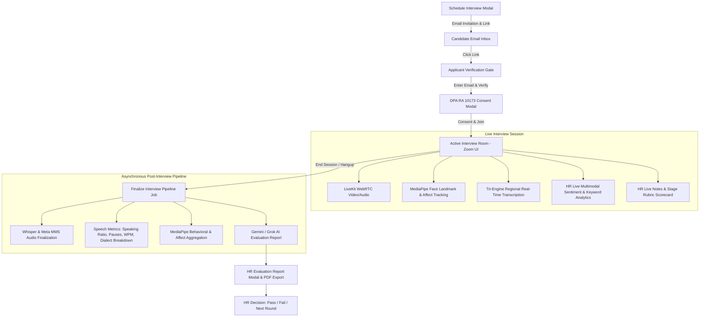

# ARTMS Interview System — Comprehensive Features & Module Specification

## 1. Executive Overview

The **ARTMS Interview System** is an enterprise-grade, AI-augmented video conferencing and candidate evaluation platform built directly into the Autonomous Recruitment & Talent Management System (ARTMS).

It bridges the entire recruitment lifecycle—from initial screening to final executive hiring—combining **LiveKit WebRTC video streaming**, **Google MediaPipe Computer Vision & Facial Affect Analysis**, **Tri-Engine Multilingual Speech Recognition (Web Speech API, Meta MMS `wav2vec2`, and Groq Whisper STT)**, and **Google Gemini & xAI Grok Large Language Models** under strict **Philippine Data Privacy Act (RA 10173)** compliance.

---

## 2. System Architecture & Technology Stack

| Layer | Technologies & Services | Purpose |
| --- | --- | --- |
| **Video & Audio Infrastructure** | LiveKit WebRTC, LiveKit Cloud Egress, `@livekit/components-react` | Ultra-low latency two-way video calls, screen sharing, server-side audio/video recording. |
| **Computer Vision & Affect AI** | Google MediaPipe `@mediapipe/tasks-vision` (FaceLandmarker) + Blendshape Sentiment Classifier | 478 3D facial landmarks, head pose orientation, micro-expression valence/arousal tracking, and blink-rate stress analysis at 15 FPS. |
| **Speech-to-Text (STT) Engine** | **Tri-Engine Matrix**:<br><br>1. Browser Web Speech API<br><br>2. **Meta MMS (`wav2vec2`)** (`ceb`, `hil`, `tgl`)<br><br>3. Groq / OpenAI Whisper (`whisper-large-v3-turbo`) | Real-time browser transcription, native low-resource Philippine regional dialect streaming (Cebuano/Bisaya & Hiligaynon/Ilonggo), and high-accuracy async fallback. |
| **Real-time Data Sync** | WebRTC Data Channels + REST API Polling | Instant sub-20ms transcript and vision metric delivery between HR & Candidate. |
| **Artificial Intelligence Engine** | Google Gemini (2.0 Flash / Pro) & xAI Grok (`grok-4.5`) | Live sentiment analysis, dialect translation, keyword extraction, automated candidate scoring & report generation. |
| **AI Safety & Quality Layer** | `AiGuardrailService` (Laravel) | Prompt injection neutralization, PII sanitization, schema enforcement, bias mitigation. |
| **Backend & Event Pipeline** | Laravel 11, PHP 8.2+, Python ASR Microservice, MySQL, Laravel Queues / Jobs | Asynchronous post-interview finalization pipeline, dialect model inference, audit logging. |
| **Frontend Framework** | React 18, Vite, Tailwind CSS, Lucide Icons, React Icons | Zoom-style responsive video stage, live analytics dashboard, evaluation modals. |

---

## 3. Core Modules & In-Depth Feature Breakdown



---

### 3.1 Multi-Stage Interview Management & Scheduling

#### Multi-Stage Workflow

The system supports standard multi-tier pipelines and customizable hiring stages:

1. **Initial Screening / Technical Assessment** (Interview 1)
2. **HR Interview / Managerial Interview** (Interview 2)
3. **Final Interview** (Executive Round)

#### Scheduling Features (`ScheduleInterviewModal.jsx`)

* **Applicant & Job Linking**: Direct linkage to registered applicant profiles and active job postings.
* **Interview Modes**:
  * **Virtual / Online**: Automatically provisions a dedicated, secure meeting URL (`/interview/{id}/room`) using dynamic LiveKit room identifiers.
  * **In-Person**: Custom venue and office location details.
  * **Phone Call**: Contact numbers and scheduled callback times.
* **Precision Date & Time**: 24-hour time slots with timezone support (`PST GMT+08:00`, `UTC`, `EST`).
* **Duration Configuration**: Predefined durations (15, 30, 45, 60, 90 minutes).
* **Interviewer Assignment**: Assign multiple internal interviewers or department heads with instant in-app and email notifications.
* **Automated Email Dispatch**:
  * Sends a branded HTML invitation email (`emails.interview_invitation`) with candidate name, position, stage, scheduled date/time, and secure one-click join link.
  * Generates automated calendar reminder emails (`emails.interview_reminder`).

---

### 3.2 Candidate Verification & Data Privacy Gate (RA 10173)

#### 1. Identity Verification Gate

To prevent unauthorized entry and protect candidate confidentiality, external public participants visiting an interview link must verify their registered email address against the backend database before token generation.

#### 2. DPA Consent Modal (Republic Act No. 10173)

Before camera and microphone permissions are requested, candidates are presented with a mandatory Data Privacy Notice detailing:

* Audio and video stream recording policies.
* Real-time transcription and MediaPipe biometric/expression processing.
* Automated AI evaluation transparency and HR-only data retention access.
* Options to **"I Consent & Join Interview"** or **"Decline & Exit"**.

---

### 3.3 Live Video Conferencing & Virtual Room (`ActiveInterviewRoom.jsx`)

#### Dynamic View Rendering

* **Applicant View (`ZoomApplicantLayout`)**: A distraction-free, full-screen video stage with picture-in-picture local camera and participant badges.
* **Interviewer View (`ZoomInterviewerLayout`)**: An analytics-rich workspace displaying the video stage alongside live AI sentiment metrics, dialect-aware transcript feed, position requirements, and an interactive evaluation sidebar.

#### Hardware Controls & Streaming Features

* **Microphone & Camera Toggles**: Hardware-synchronized mute/unmute states with visual feedback.
* **Screen Sharing**: Native browser screen capture track publishing with auto-focus stage layout.
* **Picture-in-Picture (PiP)**: Draggable/hoverable local video stream preview.
* **Philippine Regional Dialect Selector**:
  * `ceb-PH` — Cebuano / Bisaya (Meta MMS Adapter `ceb` / Whisper)
  * `hil-PH` — Hiligaynon / Ilonggo (Meta MMS Adapter `hil`)
  * `fil-PH` — Filipino / Tagalog / Taglish (Web Speech / Meta MMS `tgl`)
  * `en-PH` — Philippine English
  * `en-US` — Standard English

---

### 3.4 Tri-Engine Real-Time Multilingual Transcription

To resolve speech recognition gaps across Philippine regional dialects, ARTMS implements a **Tri-Engine Transcription Matrix**:

```
                          Candidate Audio Stream
                                     │
       ┌─────────────────────────────┼─────────────────────────────┐
       ▼                             ▼                             ▼
  [Engine A]                    [Engine B]                    [Engine C]
Browser Web Speech API      Meta MMS (wav2vec2)        Whisper Large v3 Turbo
 (Local / Zero Latency)     (ceb / hil Dialects)       (Rolling 3s Chunks)
       │                             │                             │
  Sub-20ms UI Stream        WebSocket Microservice         Async Accuracy Layer
       │                             │                             │
       └──────────────────────┬──────┴─────────────────────────────┘
                              ▼
           Deduplication & Dialect Fusion Layer (Sliding Hash)
                              │
              LiveKit Data Channel Broadcast (20ms)
                              │
              Persisted to DB (interview_transcripts)
```

1. **Engine A: Browser-Native Web Speech API**
   * Provides sub-20ms instant visual feedback for general English and Tagalog input.

2. **Engine B: Meta MMS (`wav2vec2`) WebSocket Microservice (Native Dialects)**
   * Powered by Meta's **Massively Multilingual Speech (MMS)** model (`facebook/mms-1b-all`).
   * Dynamically loads specific language adapter heads:
     * `ceb` for native **Cebuano / Bisaya** phoneme decoding.
     * `hil` for native **Hiligaynon / Ilonggo** vocabulary.
   * Eliminates standard STT hallucination on regional Visayan terms.

3. **Engine C: Groq / OpenAI Whisper Large v3 Turbo**
   * Ingests rolling 3-second audio buffers (`MediaRecorder`) to verify sentence boundaries and complex code-switched phrases (e.g., Bislish / Taglish).

4. **Smart Deduplication & Persistence**:
   * 4-second sliding hash window prevents duplicate text segments across engines.
   * Asynchronous database storage with dialect metadata, speaker roles (`hr`, `applicant`, `system`), and segment timestamps.

---

### 3.5 Real-Time Computer Vision & Facial Affect Analysis

Powered by client-side **Google MediaPipe FaceLandmarker** (478 3D landmarks) running at a throttled **15 FPS**, enhanced with an integrated **Facial Expression & Affective State Classifier**:

```
            ┌────────────────────────────────────────────────────────┐
            │       MediaPipe Vision & Affect Analysis (15 FPS)      │
            └───────────────────────────┬────────────────────────────┘
                                        │
             ┌──────────────────────────┼──────────────────────────┐
             ▼                          ▼                          ▼
     ┌───────────────┐          ┌───────────────┐          ┌───────────────┐
     │ Attentiveness │          │   Composure   │          │ Facial Affect │
     │     Index     │          │     Index     │          │  & Sentiment  │
     └───────┬───────┘          └───────┬───────┘          └───────┬───────┘
             │                          │                          │
      Eye Aspect Ratio           Head Pose Jitter           Blendshape Emotion
     & Gaze Fixation Vector      (Pitch, Yaw, Roll)         Valence & Micro-Cues
```

#### Monitored Vision & Behavioral Metrics

* **Attentiveness Index (0–100%)**: Evaluates Eye Aspect Ratio (EAR), gaze fixation vector, and pupil symmetry to verify eye contact with the interviewer.
* **Composure & Stability Index (0–100%)**: Tracks continuous head pose angular velocity (Pitch, Yaw, Roll) and rapid micro-movements to detect fidgeting vs. grounded composure.
* **Facial Affect & Sentiment Classification**:
  * Leverages MediaPipe facial blendshapes (`browDown`, `mouthSmile`, `jawOpen`, `eyeBlink`) to compute **Valence (Positive/Negative expression)** and **Arousal (Energy/Reactivity)**.
  * Detects micro-expressions: Confidence/Warmth, Concentration, Neutrality, Skepticism, or High Stress.
* **Real-Time HR Composure Badge**:
  * `Composed & Focused` (Indigo)
  * `Engaged & Positive` (Emerald)
  * `Neutral & Attentive` (Slate)
  * `Hesitant / Stressed` (Orange — triggered by elevated blink frequency + tense brow blendshapes)
  * `Distracted / Looking Away` (Amber)
  * `No Face Detected` (Red)
* **Periodic Metric Flushing**:
  * Sampled locally every **3 seconds**.
  * Flushed in batches to backend MySQL every **15 seconds** and upon call completion (`interview_behavioral_metrics`).
* **Interactive Debug Canvas Overlay**:
  * Adding `?debug=true` renders the 478-point 3D facial wireframe mesh and live blendshape weight meters.

---

### 3.6 Live Multimodal AI Sentiment & Keyword Analysis

* **xAI Grok 4.5 & Gemini Flash Engine**: Fuses transcript text with live vision affect data.
* **Extracted Analytics**:
  * **Multimodal Sentiment Score**: Cross-references spoken confidence with facial micro-expressions.
  * **Regional Dialect Translation**: Translates local Bisaya/Ilonggo responses into standard English summaries for non-local HR panels.
  * **Skills & Keyword Extraction**: Auto-detects technical competencies, soft skills, and leadership indicators in real-time.
  * **Job Requirement Match %**: Radial indicator showing instant qualification alignment.

---

### 3.7 In-Session Interviewer Sidebar & Live Tools

1. **Recording Status Tab**:
   * Live monitoring of server-side LiveKit Egress audio/video recording (`Recording Active`, `Completed`, `Failed`).
2. **Interviewer Evaluation Notes Tab**:
   * Real-time debriefing textarea with automatic debounced saving to database (`/api/interviews/{id}/notes`).
3. **Candidate Rating Rubric Tab**:
   * Quick in-session star ratings across Technical Competency, Communication Skills, Problem Solving, and Cultural Alignment.

---

### 3.8 Asynchronous Post-Interview Pipeline (`FinalizeInterviewPipelineJob`)

```
[Interview Ended] 
       │
       ▼
1. Finalize Audio Streams ─────► Whisper Large v3 & Meta MMS Dialect Alignment
       │
       ▼
2. Compute Speech Metrics ─────► Speaking Ratio (%), Pauses (>5s), Dialect Ratios
       │
       ▼
3. Aggregate Affect Metrics ───► Average Attentiveness, Composure, Facial Valence
       │
       ▼
4. Generate AI Report Job ─────► Gemini 2.0 / Grok Multimodal Evaluation
       │
       ▼
[AiInterviewReport Created] ───► Update Applicant Status & Notify HR
```

#### Computed Speech & Behavioral Metrics:

* **Total Word Count & Pacing**: Quantitative words per minute (WPM).
* **Applicant Speaking Ratio (%)**: Percentage of total speaking time candidate vs. interviewer.
* **Long Pause Count**: Frequency of pauses exceeding 5 seconds.
* **Dialect Breakdown**: Percentage distribution of languages spoken during the call (`English`, `Filipino`, `Cebuano`, `Hiligaynon`).

---

### 3.9 Comprehensive Post-Interview AI Report (`AiInterviewReport`)

Generated by **Google Gemini** with structured schema validation:

| Report Section | Description & Format |
| --- | --- |
| **Overall Performance Score** | Weighted composite score (0–100%) reflecting performance against job requirements. |
| **Communication Score** | Clarity, articulation, conversational pacing, and dialect adaptability score (0–100%). |
| **Confidence & Composure Score** | Speech steadiness combined with MediaPipe head/eye composure and affect stability (0–100%). |
| **Candidate Strengths** | 2 to 4 bullet points highlighting verified technical proficiencies and positive soft skills. |
| **Areas for Improvement** | 1 to 3 constructive, objective development points phrased with non-biased language. |
| **Hiring Recommendation** | Executive summary recommending whether to advance, hire, or re-evaluate. |
| **Score Rationale** | Deep breakdown detailing the evidence and metrics behind assigned ratings. |
| **Full Interactive Transcript** | Timestamped dialogue history with dialect badges, speaker tags, and English translations. |

---

### 3.10 Manual Stage Evaluation & Rubrics (`EvaluationModal.jsx`)

Provides HR administrators with structured scorecard evaluation forms tailored to each round:

* **Interview 1 / Screening**: Communication Skills, Professionalism, Experience, Problem Solving (1–5 Stars).
* **Interview 2 / Managerial**: Technical Knowledge, Teamwork, Leadership Potential, Cultural Fit, Drive (1–5 Stars).
* **Final Interview**: Executive Fit, Motivation & Commitment, Values Alignment (1–5 Stars).
* **Outcome Transitions**: Auto-calculates composite scores and triggers candidate state transitions (`interview_x_done` ➔ `hire` / `job_offer`).

---

### 3.11 Interactive Interview Calendar (`InterviewCalendar.jsx`)

* **View Modes**: Month Grid, Weekly Schedule, Daily Timeline.
* **Calendar Highlights**: Status-coded tiles for scheduled, confirmed, completed, or cancelled interviews.
* **Direct Actions**: Instant room launch, AI report viewer, calendar syncing, and candidate profile drawer.

---

### 3.12 Security, Compliance & Audit Logging

* **Sanctum Token Authentication**: Protected routes with permission gates (`view_interviews`, `schedule_interviews`, `evaluate_interviews`).
* **Role-Based Access Control (RBAC)**: Super Admin, HR Admin, COO, and Department Head visibility tiers.
* **Audit Logging (`AuditLog`)**: Immutable event logging (room creation, attendance confirmation, LiveKit join/leave, note autosaves, AI report dispatch) with actor ID, IP address, and timestamp.
* **Data Protection**: Input sanitization defuses prompt injection attempts; no raw PII is exposed to external model prompts without `AiGuardrailService` token masking.

---

## 4. Database Schema Reference

```
┌──────────────────────────────┐       ┌──────────────────────────────┐
│          interviews          │       │    interview_transcripts     │
├──────────────────────────────┤       ├──────────────────────────────┤
│ id (PK)                      │1     *│ id (PK)                      │
│ applicant_id (FK)            ├───────┤ interview_id (FK)            │
│ job_posting_id (FK)          │       │ speaker_identity             │
│ interviewer_id (FK)          │       │ speaker_role (hr/applicant)  │
│ interview_stage              │       │ text                         │
│ interview_type               │       │ dialect_detected (ceb/hil/..)│
│ scheduled_at                 │       │ translated_text              │
│ meeting_link                 │       │ segment_offset               │
│ livekit_room_name            │       │ spoken_at                    │
│ status                       │       └──────────────────────────────┘
│ applicant_confirmed (bool)   │1     1┌──────────────────────────────┐
│ rating_score (0-100)         ├───────┤ interview_behavioral_metrics │
│ hr_decision (pass/fail)      │       ├──────────────────────────────┤
│ evaluation_notes             │       │ id (PK)                      │
│ rubric_scores (JSON)         │       │ interview_id (FK)            │
│ recording_status             │       │ speech_metrics (JSON)        │
│ transcription_status         │       │ affect_metrics (JSON)        │
│ analysis_status              │       │ aggregated_metrics (JSON)    │
│ report_status                │1     1└──────────────────────────────┘
│ ai_summary                   ├───────┌──────────────────────────────┐
└──────────────────────────────┘       │     ai_interview_reports     │
                                       ├──────────────────────────────┤
                                       │ id (PK)                      │
                                       │ interview_id (FK)            │
                                       │ overall_score (0-100)        │
                                       │ communication_score          │
                                       │ confidence_score             │
                                       │ strengths (JSON)             │
                                       │ weaknesses (JSON)            │
                                       │ hiring_recommendation (TEXT) │
                                       │ dialect_summary (JSON)       │
                                       │ raw_ai_response (JSON)       │
                                       │ model_used                   │
                                       │ generated_at                 │
                                       └──────────────────────────────┘
```

---

## 5. Key Differentiators

1. **End-to-End Recruitment Lifecycle**: Complete pipeline automation from calendar dispatch to stage-by-stage rubric evaluation.
2. **Philippine Regional Dialect Native**: Integrated **Meta MMS (`ceb`/`hil`)** model stack ensuring accurate recognition of Bisaya, Ilonggo, Tagalog, and English without dialect degradation.
3. **Computer Vision & Affect AI**: Real-time 478-point MediaPipe face tracking measuring gaze fixation, head composure, blink-rate stress, and facial sentiment valence.
4. **Multimodal Co-Pilot**: Real-time interviewer analytics powered by Grok and Gemini with instant keyword identification and translation.
5. **DPA RA 10173 Compliance**: Automated identity gates, explicit biometric consent collection, and encrypted audit logging.
